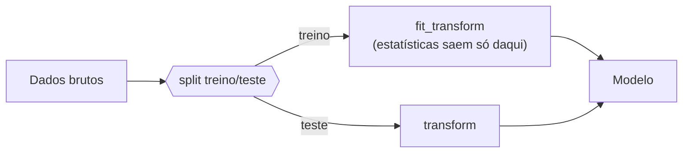

# 1. EDA — Análise Exploratória

!!! abstract "Entrega 1 de 3 do [Projeto](../index.md)"

    [Projects](https://insper.github.io/ann-dl/){:target='_blank'}

!!! info "Equipe"

    | Nome completo | GitHub |
    |---------------|--------|
    | | |
    | | |
    | | |

    Dataset, decisões e status: [página do projeto](../index.md).

!!! tip "O que esta entrega decide"

    O EDA não é um álbum de gráficos: é onde a equipe **escolhe o dataset** e descobre o que
    vai atrapalhar o treino depois — desbalanceamento, vazamento, escalas incompatíveis com a
    ativação, ausências não aleatórias. Cada achado aqui deve virar uma linha do plano de
    pré-processamento no fim da página, e é esse plano que as duas entregas
    seguintes executam.

## 1. Dataset

Nome, fonte, licença, dimensões e **por que** este dataset. Se houve troca em relação a uma
ideia anterior, diga qual e por quê.

## 2. Estrutura e tipos

Quantas amostras, quantas features, e o tipo de cada uma (numérica contínua, discreta,
categórica nominal, ordinal, data, texto). Aponte as que estão com o tipo errado no arquivo
bruto — um CEP lido como inteiro é numérico para o pandas e categórico para o modelo.

| Feature | Tipo | Cardinalidade / faixa | Observação |
|---------|------|-----------------------|------------|
| | | | |

## 3. Variável alvo

Distribuição do alvo e o que ela implica.

- **Classificação:** proporção por classe, razão entre a maior e a menor.
- **Regressão:** distribuição, assimetria, cauda, presença de zeros ou censura.

/// caption
**Figura 1** — Distribuição da variável alvo.
///

!!! question "Responda"

    O quão desbalanceado está? Um classificador que sempre responde a classe majoritária
    acerta quantos por cento? Esse número é o seu *baseline* — as entregas seguintes precisam
    superá-lo.

## 4. Análise univariada

Distribuição de cada feature relevante: medidas de posição e dispersão, e o formato.
Não gere 40 histogramas; escolha os que mudam alguma decisão e explique o critério.

## 5. Análise bivariada e correlações

Relação entre as features e o alvo, e entre as features.

!!! danger "Correlação alta demais com o alvo é suspeita"

    Uma feature que prevê o alvo quase perfeitamente costuma ser **vazamento**: informação
    que só existe depois do fato que você quer prever. Investigue antes de comemorar.

## 6. Qualidade dos dados

### Valores ausentes

| Feature | % ausente | Padrão (aleatório?) | Tratamento planejado |
|---------|-----------|---------------------|----------------------|
| | | | |

Ausência raramente é aleatória. Se falta mais em um grupo do que em outro, o próprio "estar
ausente" carrega informação.

### Duplicatas e inconsistências

Linhas repetidas, categorias escritas de formas diferentes, unidades misturadas, datas
impossíveis.

### Outliers

Como foram detectados e o que será feito com eles — e por quê. Remover outlier é decisão de
modelagem, não faxina.

## 7. Riscos de vazamento

Liste as fontes de vazamento identificadas e como cada uma será contida.

| Risco | Onde aparece | Contenção |
|-------|--------------|-----------|
| Estatísticas calculadas antes do split | | Ajustar transformadores só no treino |
| | | |

## 8. Plano de pré-processamento

A saída desta entrega. Uma linha por transformação, ligando cada uma a um achado acima.

| # | Transformação | Features | Motivo (seção) |
|---|---------------|----------|----------------|
| 1 | | | |

## 9. Estratégia de split

Proporções, estratificação, e o que impede uma mesma entidade de cair nos dois lados
(agrupamento por usuário, por data, por sessão).

## Results summary

| # | Métrica | Valor |
|---|---------|-------|
| 1 | Amostras | |
| 2 | Features (antes / depois do encoding) | |
| 3 | Features com ausentes | |
| 4 | Maior % de ausência em uma feature | |
| 5 | Linhas duplicadas | |
| 6 | Razão de desbalanceamento do alvo | |
| 7 | Acurácia (ou erro) do baseline trivial | |
| 8 | Maior correlação feature–alvo | |
| 9 | Amostras treino / teste após o split | |

## Conclusão

O que o dataset permite e o que ele impede. Se algum achado inviabiliza a tarefa pretendida,
é aqui que a equipe muda de rumo — ainda dá tempo.

## Referências
