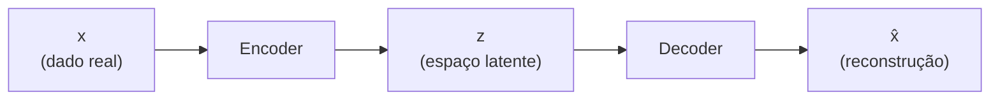

# 3. Generativo

!!! abstract "Entrega 3 de 3 do [Projeto](../index.md)"

    [Projects → Generative](https://insper.github.io/ann-dl/){:target='_blank'}

!!! info "Equipe"

    | Nome completo | GitHub |
    |---------------|--------|
    | | |
    | | |
    | | |

    Dataset, decisões e status: [página do projeto](../index.md).

!!! tip "A mudança de pergunta"

    As entregas anteriores perguntavam $p(y \mid \mathbf{x})$ — dado um exemplo, qual o
    rótulo. Esta pergunta $p(\mathbf{x})$: como os dados foram gerados, e como produzir
    amostras novas que poderiam ter vindo do mesmo lugar. Isso muda tudo, inclusive a
    avaliação: não existe "acurácia" de uma amostra gerada.

O dataset e as decisões da equipe ficam na [página do projeto](../index.md). Reaproveite o
[EDA](../eda/index.md) — o que você descobriu sobre distribuições e desbalanceamento é
exatamente o que o modelo generativo precisa reproduzir.

## 1. Objetivo

O que será gerado e para quê. Se a intenção é aumentar dados da classe minoritária
identificada no EDA, diga isso — e a seção 7 vai medir se funcionou.

## 2. Modelo escolhido

Qual família (VAE, GAN, difusão, flow matching) e **por que ela**, dado o tipo de dado e o
tamanho do dataset.

| | |
|---|---|
| **Família** | |
| **Por que esta** | |
| **Alternativa descartada** | |
| **Motivo do descarte** | |

## 3. Arquitetura

Encoder/decoder, gerador/discriminador ou rede de *denoising*, com dimensões e ativações.

Descreva o **espaço latente**: dimensão e por quê. Latente pequeno demais perde detalhe;
grande demais vira cópia com ruído.

## 4. Função objetivo

Escreva a perda e explique cada termo. Num VAE, por exemplo:

$$
\mathcal{L} = \underbrace{\mathbb{E}_{q(\mathbf{z}\mid\mathbf{x})}[\log p(\mathbf{x}\mid\mathbf{z})]}_{\text{reconstrução}}
- \beta \, \underbrace{D_{\mathrm{KL}}\!\left(q(\mathbf{z}\mid\mathbf{x}) \,\|\, p(\mathbf{z})\right)}_{\text{regularização do latente}}
$$

O equilíbrio entre os termos é uma decisão sua: diga qual valor usou e o que acontecia nos
extremos que você testou.

## 5. Treinamento

Hiperparâmetros, tempo de treino e as patologias enfrentadas — *posterior collapse*,
*mode collapse*, discriminador que domina, perda que diverge. Diga como diagnosticou cada
uma e o que fez.

/// caption
**Figura 1** — Componentes da perda ao longo das épocas.
///

## 6. Amostras geradas

Amostras **não selecionadas a dedo** — uma grade aleatória, não as melhores. Se houver
seleção, declare o critério.

/// caption
**Figura 2** — Amostras geradas a partir de $\mathbf{z} \sim \mathcal{N}(0, I)$.
///

Se o espaço latente for interpretável, mostre uma interpolação entre dois pontos e comente
se a transição é suave — transição abrupta indica latente mal estruturado.

## 7. Avaliação

Métricas generativas não medem acerto, medem **fidelidade e diversidade** — e as duas
podem ser trocadas uma pela outra. Reporte as duas dimensões.

| Métrica | Valor | O que mede |
|---------|-------|------------|
| | | |

Complemente com comparações diretas contra os dados reais: distribuição das features geradas
contra a original, estatísticas por classe, e uma inspeção qualitativa honesta.

!!! question "Memorização"

    Um modelo generativo que reproduz exemplos do treino não generalizou — decorou. Verifique
    a distância entre cada amostra gerada e seu vizinho mais próximo no conjunto de treino, e
    relate o resultado mesmo que seja desfavorável.

### O modelo serviu ao propósito?

Se o objetivo da seção 1 era aumentar dados, treine novamente o modelo da entrega
anterior com os dados sintéticos e compare as métricas. Essa comparação é o teste real.

| Cenário | Métrica principal |
|---------|-------------------|
| Só dados reais | |
| Reais + sintéticos | |

## Conclusão

O que o modelo aprendeu sobre a distribuição, onde falhou, e o que a equipe faria diferente.

## Referências
