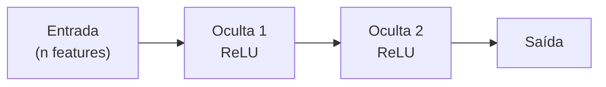

# 2. Regressão

!!! abstract "Entrega 2 de 3 do [Projeto](../index.md)"

    [Projects → Regression](https://insper.github.io/ann-dl/){:target='_blank'}

!!! info "Equipe"

    | Nome completo | GitHub |
    |---------------|--------|
    | | |
    | | |
    | | |

    Dataset, decisões e status: [página do projeto](../index.md).

!!! warning "Esta entrega é uma escolha"

    A equipe entrega **classificação ou regressão**, não as duas. Se a escolha foi a outra,
    apague esta pasta e a linha correspondente na `nav` do `mkdocs.yml`.

O dataset e as decisões da equipe ficam na [página do projeto](../index.md). As duas
primeiras seções abaixo são exigidas pelo enunciado, mas o [EDA](../eda/index.md) já as
respondeu em profundidade: **resuma e aponte para lá**, em vez de refazer a análise.

## 1. Escolha do dataset

Nome, URL da fonte, dimensões e por que ele sustenta uma tarefa de regressão não trivial.

## 2. Descrição do dataset

Features, variável alvo, contexto do domínio e os problemas herdados do EDA que esta entrega
precisa resolver.

## 3. Limpeza e normalização

Execute o plano de pré-processamento definido no [EDA](../eda/index.md#8-plano-de-pre-processamento)
e relate o que mudou em relação ao planejado — e por quê.

!!! note "Escala do alvo"

    Se o alvo foi transformado (log, Box-Cox, padronização), a inversão precisa ser aplicada
    antes de calcular as métricas da seção 8 — senão os números não são interpretáveis no
    domínio.

## 4. Implementação da MLP

Arquitetura, funções de ativação, função de perda e otimizador, **com a justificativa de cada
escolha**. Uma tabela de hiperparâmetros não explica nada sozinha.

| | Escolha | Por quê |
|---|---------|---------|
| Camadas ocultas | | |
| Ativação | | |
| Função de perda | | |
| Otimizador | | |
| Learning rate | | |
| Batch size | | |

## 5. Treinamento

O loop de treino e as dificuldades enfrentadas: instabilidade, perda que não desce,
saturação da ativação, tempo de época. Diga o que você tentou e o que resolveu.

## 6. Estratégia de treino e teste

Proporções do split, esquema de validação e como o *overfitting* foi contido (early stopping,
regularização, dropout). O split precisa ser o mesmo definido no EDA — se mudou, justifique.

## 7. Curvas de erro

/// caption
**Figura 1** — Perda de treino e de validação por época.
///

Leia a curva no texto: em que época a validação para de melhorar, e o que a distância entre
as duas curvas diz sobre a capacidade do modelo.

## 8. Métricas de avaliação

| Métrica | Treino | Validação | Teste |
|---------|--------|-----------|-------|
| MAE | | | |
| RMSE | | | |
| MAPE | | | |
| $R^2$ | | | |

Inclua o gráfico de resíduos ($y - \hat{y}$ contra $\hat{y}$). Resíduo com estrutura visível
indica que o modelo deixou sinal na mesa; resíduo que abre em leque indica variância
dependente da escala — e talvez a necessidade de transformar o alvo.

Compare com o **baseline trivial** do EDA. Um modelo que não supera o baseline é um resultado
— relate-o como tal, não o esconda.

## Conclusão

Principais achados, limitações e o que a equipe faria com mais tempo.

## Referências
