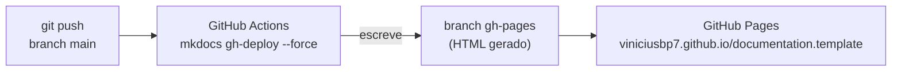
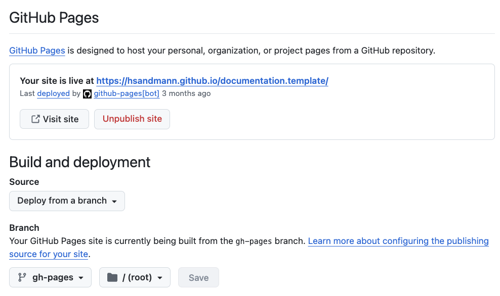

# Como usar este template

Este repositório gera o site de entregas da disciplina. O fluxo é sempre o mesmo: você
edita um Markdown (ou commita um notebook) dentro de `docs/`, dá `git push` na `main`, e o
GitHub Actions publica o site.

## Estrutura de pastas

Os nomes abaixo são um **contrato** com a correção — não os renomeie.

``` { .text title="estrutura" }
docs/
  index.md                       # capa: identificação e status das entregas
  template/
    index.md                     # esta página
  exercises/
    data/
      index.ipynb                # entrega em notebook (enunciado + resolução)
    perceptron/
      index.md                   # o relatório
      code/                      # scripts, como arquivos executáveis
      figures/                   # imagens commitadas
    mlp/
    vae/
  projects/
    index.md                     # visão geral: equipe, dataset, as 3 entregas
    eda/
      index.md
      code/
      figures/
    classification/              # escolha classification OU regression
    regression/                  # e apague a pasta que sobrar
    generative/
mkdocs.yml
requirements.txt
```

**Cada entrega tem a própria pasta**, sempre com o mesmo formato: `index.md` para o
relatório, `code/` para os scripts e `figures/` para as imagens. Se a entrega for um
notebook, ele entra na mesma pasta — `index.ipynb` no lugar de `index.md`, como já está
feito em `exercises/data/`.

O projeto é **um só**: as três entregas de `projects/` compartilham equipe e dataset, e a
segunda é *classificação ou regressão*, nunca as duas.

## Front matter obrigatório

Todo relatório em Markdown começa com:

``` { .yaml .copy title="docs/exercises/<slug>/index.md" }
---
exercise: perceptron
ai_use: "descreva o uso de IA, ou 'none'"
---
```

Nos projetos, troque `exercise:` por `project:` (`eda`, `classification`, `regression`,
`generative`).

## Colocando uma entrega no menu

Um item de menu por entrega, em `mkdocs.yml`. O alvo pode ser Markdown, notebook `.ipynb`
ou um link do Colab:

``` { .yaml .copy title="mkdocs.yml" }
nav:
  - Perceptron: exercises/perceptron/index.md               # (1)!
  - Data: exercises/data/index.ipynb                        # (2)!
  - MLP: https://colab.research.google.com/drive/1AbC       # (3)!
```

1.  **Markdown** — o formato esperado pelo enunciado. Caminho relativo a `docs/`.
2.  **Notebook** — o `.ipynb` é renderizado pelo `mkdocs-jupyter`, com as saídas que
    estiverem salvas no arquivo.
3.  **Link externo** — qualquer URL absoluta vira um item que abre fora do site.

Para trazer um script para dentro de um relatório Markdown sem copiar e colar:

```` { .markdown .copy title="docs/exercises/perceptron/index.md" }
``` { .python .copy linenums='1' title="perceptron.py" }
;--8<-- "docs/exercises/perceptron/code/perceptron.py"
```
````

O caminho é relativo à **raiz do repositório** (`base_path: [.]`). Se o arquivo não
existir, o build falha — o que é bom: você descobre o link quebrado antes do professor.

!!! warning "Notebook: salve com as saídas"

    O build roda com `execute: false` — nada é executado na publicação. Gráficos e
    resultados só aparecem no site se estiverem **salvos dentro do `.ipynb`** commitado.
    Rode todas as células, salve, e só então faça o commit.

## Antes de publicar

Todas as linhas do `mkdocs.yml` que você precisa trocar estão marcadas com `# TROCAR`. Para
achar todas:

``` shell
grep -n "TROCAR" mkdocs.yml
```

O passo a passo completo está em [Publicação no GitHub Pages](#publicacao-no-github-pages).

---

## Pré-requisitos

Antes de começar, certifique-se de que você possui os seguintes pré-requisitos instalados em seu sistema:

- **Git**: Para clonar o repositório.

## Instalando o Python

Python **3.10 ou superior**. O GitHub Actions constrói o site com a versão definida em
`PYTHON_VERSION`, no
[workflow](https://github.com/viniciusbp7/documentation.template/blob/main/.github/workflows/main.yaml) —
usar localmente a mesma versão evita surpresas entre o seu build e o do CI.

=== "Linux"

    Instale o Python 3.10 ou superior.

    ``` shell
    sudo apt install python3 python3-venv python3-pip
    python3 --version
    ```

=== "macOS"

    Instale o Python 3.10 ou superior.

    ``` shell
    brew install python
    python3 --version
    ```

=== "Windows"

    Instale o Python 3.10 ou superior. Baixe o instalador do site oficial do Python ([https://www.python.org/downloads/](https://www.python.org/downloads/){:target="_blank"}) e execute-o. Certifique-se de marcar a opção "Add Python to PATH" durante a instalação.

    ``` shell
    python --version
    ```

---

## Instalando as dependências

Para rodar o site na sua máquina, siga os passos a seguir.

Clone ou fork este repositório:

``` shell
git clone <URL_DO_REPOSITORIO>
```

Crie um ambiente virtual do Python:

=== "Linux/macOS"
    ``` shell
    python3 -m venv env
    ```

=== "Windows"

    ``` shell
    python -m venv env
    ```

Ative o ambiente virtual (**você deve fazer isso sempre que for executar algum script deste repositório**):

=== "Linux/macOS"
    ``` shell
    source ./env/bin/activate
    ```

=== "Windows"
    ``` shell
    .\env\Scripts\activate
    ```

Instale as dependências com:

=== "Linux/macOS"

    ``` shell
    python3 -m pip install -r requirements.txt --upgrade
    ```

=== "Windows"

    ``` shell
    python -m pip install -r requirements.txt --upgrade
    ```

## Publicação no GitHub Pages

O site não é publicado a partir da `main`: o GitHub Actions constrói o HTML e o empurra para
uma branch separada, `gh-pages`, e é ela que o GitHub Pages serve.



Isso significa que **você nunca edita a `gh-pages` à mão** — ela é reescrita a cada push.

Os passos 1 a 4 são feitos **uma única vez**. Depois disso, publicar é dar `git push`.

### Passo 1 — Repositório público e Actions habilitado

Mantenha o repositório **público**: a correção lê o site e o repositório, e o GitHub Pages
exige repositório público em contas gratuitas.

!!! warning "Se você usou *Fork*, os workflows vêm desligados"

    Em um fork, o GitHub desabilita o Actions por segurança. Abra a aba **Actions** do seu
    repositório e clique em **I understand my workflows, go ahead and enable them**. Sem
    isso, o push não dispara build nenhum e o site nunca aparece.

### Passo 2 — Garantir que o CI possa escrever

O workflow precisa **escrever** na branch `gh-pages`, e o token do Actions não tem esse
escopo por padrão. O workflow deste template já o pede explicitamente:

``` { .yaml title=".github/workflows/main.yaml" }
permissions:
  contents: write
```

Esse bloco sobrepõe o padrão do repositório, então **normalmente não há nada a fazer aqui**.
Ele só não basta em dois casos: se você removeu o bloco, ou se uma política do repositório
ou da organização impede que o workflow eleve o próprio escopo.

!!! failure "Se o build falhar no último passo"

    O sintoma é `remote: Permission to viniciusbp7/documentation.template.git denied to github-actions[bot]`
    ou `error: failed to push some refs`. A correção é em
    **Settings → Actions → General → Workflow permissions**: marque
    **Read and write permissions**, salve, e re-execute o workflow em
    **Actions → (o run que falhou) → Re-run all jobs**.

    
    /// caption
    **Settings → Actions → General → Workflow permissions**
    ///

O workflow completo:

``` { .yaml title=".github/workflows/main.yaml" }
--8<-- ".github/workflows/main.yaml"
```

### Passo 3 — Publicar

``` shell
git add .
git commit -m "exercises/perceptron: relatório do exercício"
git push
```

Acompanhe em **Actions**. O primeiro run cria a branch `gh-pages`; leva 1–2 minutos.

!!! tip "Disparar sem commit"

    O workflow também aceita disparo manual: **Actions → ci → Run workflow**. Útil para
    republicar depois de mexer numa configuração do GitHub, sem precisar inventar um commit.

!!! danger "O prazo é o seu último commit"

    O prazo de uma entrega é o *timestamp do último commit que toca a pasta daquela entrega*
    — não a hora do formulário nem a da publicação. Commite ao longo do trabalho, não tudo
    no minuto do prazo.

### Passo 4 — Apontar o Pages para a branch `gh-pages`

Só depois que o primeiro run terminar (a branch precisa existir): em **Settings → Pages**,
em *Build and deployment*, escolha **Deploy from a branch**, selecione a branch **`gh-pages`**
e a pasta **`/ (root)`**, e salve.


/// caption
**Settings → Pages → Build and deployment**
///

O endereço aparece no topo dessa mesma tela, no formato
`https://viniciusbp7.github.io/documentation.template/`. Ele precisa ser **idêntico** ao
`site_url` do `mkdocs.yml` — é dele que o Material monta os links do menu e o `sitemap.xml`.

### Passo 5 — Conferir

- [ ] O run em **Actions** terminou com o check verde.
- [ ] A branch `gh-pages` existe e tem um `index.html` na raiz.
- [ ] A URL de **Settings → Pages** abre o site.
- [ ] O menu tem as suas entregas, e nenhum link quebrado.

### Validando antes do push

O CI publica mesmo com avisos; o modo estrito, não. Rode localmente antes de commitar:

``` shell
mkdocs serve -o                  # preview com recarga automática
mkdocs build --strict            # falha em link quebrado ou snippet inexistente
```

### Publicação manual

Se precisar publicar sem esperar o CI — ou se o Actions estiver indisponível:

``` shell
mkdocs gh-deploy
```

O comando constrói o site e empurra para a `gh-pages` usando **as suas** credenciais do Git.
Ele não substitui o Passo 2: assim que você voltar a dar `push` na `main`, quem publica é o CI.

### Quando não funcionar

| Sintoma | Causa provável |
|---|---|
| Nenhum run aparece em **Actions** depois de um push | Workflows desabilitados no fork (Passo 1) — o botão *Run workflow* pode funcionar mesmo assim |
| Run falha com `Permission ... denied to github-actions[bot]` | O `permissions:` do workflow foi removido, ou a política do repositório bloqueia a elevação (Passo 2) |
| **Settings → Pages** não oferece a branch `gh-pages` | O primeiro run ainda não terminou (Passo 3) |
| Site abre em 404 | Fonte do Pages não configurada (Passo 4), ou repositório privado |
| Site abre, mas CSS e links estão quebrados | `site_url` diferente da URL real do Pages |
| Build falha em `Snippet at path ... could not be found` | `--8<--` apontando para arquivo que não existe ou não foi commitado |
| Notebook aparece sem os gráficos | O `.ipynb` foi commitado sem as saídas salvas — o CI roda com `execute: false` |
